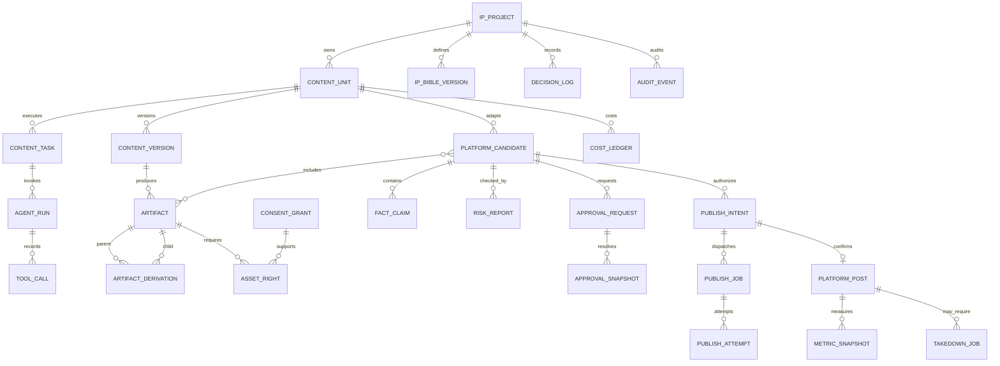

# Core data model

- Status: Ready for founder review
- Version: 0.1 (conceptual; no migration yet)
- Related: [MVP PRD](../product/prd-mvp.md), [content lifecycle](../specs/content-lifecycle.md), [ADR-0004](../adr/0004-postgresql-authority-and-deferred-vectors.md)

## Modeling rules

- IDs are stable opaque identifiers; implementation chooses UUIDv7 only after runtime/library compatibility tests.
- Stored timestamps are UTC; schedules also store the intended IANA time zone.
- Mutable business concepts use explicit versions. A published/approved candidate is never updated in place.
- Hashes identify canonical content/snapshots; they are not substitutes for primary keys or authorization.
- Large bytes live in object storage; PostgreSQL stores metadata, immutable object version/key, size, media type, and cryptographic digest.
- Every tenant-bound row includes the single MVP project ID even though the MVP is single-tenant, preventing accidental cross-project access patterns later.

## Main aggregates

## Aggregate responsibilities

| Aggregate / table family | Required concepts and invariants |
|---|---|
| `ip_projects`, `ip_bible_versions` | Project identity; versioned positioning, voice, prohibited areas, and effective approval. Agent may propose a bible change but cannot make it effective. |
| `content_units`, `content_versions`, `content_tasks` | Parent business lifecycle, immutable content revisions, current task/state, expected version, trace, and failure category. |
| `agent_configs`, `agent_runs`, `tool_calls` | Versioned role contract/prompt/tool allowlist/budget; run input/output hashes, Provider/model, source IDs, latency, status, cost; tool authorization and redacted result metadata. |
| `artifacts`, `artifact_derivations` | Immutable object digest/version and directed acyclic derivation edge with transformation/version. A final asset cannot pass if its dependency closure is incomplete or cyclic. |
| `asset_rights`, `consent_grants` | Rights owner/evidence, purpose, platform, territory, term, Provider, commercial/derivative/relicense scope, revocation and retention. These relational records are authoritative. |
| `platform_candidates` + candidate-artifact join | Platform/account/policy-specific immutable title, caption, normalized/sorted tags, ordered asset list, AI disclosure, schedule, canonical payload/hash, supersession relation. |
| `fact_claims`, rights manifest, `risk_reports` | Claims mapped to evidence snapshots/time/confidence/result; final asset-closure result; risk rule version/hits/R0–R4/block reason. Reports are immutable and hashable. |
| `approval_requests`, `approval_snapshots` | Requested action/risk/required roles, expiry/status; resolution binds candidate and all report/policy/account hashes plus distinct human actor(s). Revision never reuses an old approval. |
| `platform_accounts` | Platform, environment/test marker, subject/Scope/status, encrypted credential reference (not token), revoked/paused state, capabilities version. |
| `publish_intents`, outbox, `publish_jobs`, `publish_attempts` | Intent ID, request fingerprint, repost reason, atomic outbox, lease, attempt number/error class/request/response hashes, platform upload/draft references, known/unknown result and reconciliation owner. |
| `platform_posts`, `takedown_jobs` | Confirmed platform post identity and candidate/intent; revocation/removal workflow per post with platform-limitation evidence. |
| `comment_events`, `metric_snapshots` | Deduplicated platform events; source is API or manual. MVP reply text remains a draft and no send intent exists. Manual metrics store evidence and actor. |
| `cost_ledger`, `experiments` | Provider/media/storage/platform/human cost with currency and source; predeclared experiment variable/hypothesis/window so results cannot rewrite criteria retroactively. |
| `decision_log`, `audit_events` | In-product approved decisions; append-only actor/action/resource/time/trace/previous-hash/event-hash chain. Agent has no update/delete permission. |

## Authority by data type

| Question | Authoritative source | Never authoritative |
|---|---|---|
| May this asset/persona be used now? | `asset_rights` + `consent_grants` and current revocation/term | Vector search, prompt text, artifact filename |
| Is this exact candidate approved? | Valid `approval_snapshot` bound to hashes/account/expiry | UI checkbox cache, Agent answer |
| Was an external request made/succeeded? | Publish attempt plus reconciled `platform_post`/official or human evidence | Temporal retry count alone, missing response interpreted as failure |
| Is publishing stopped? | Transactional global/account stop state checked at intent and lease | Cached dashboard state |
| What did the Agent know/use? | Run/tool/source/prompt/model version records and redacted trace | Provider conversation ID alone |
| Is a policy effective? | Versioned policy record with source/effective date/approval | Latest web search result |

## Migration constraints for M1-01

M1-01 must turn this conceptual model into the smallest schema needed for the M1 vertical slice, not create every future table blindly. It must include database constraints for immutable versions, unique request fingerprints where applicable, tenant/project scoping, outbox atomicity, and append-only audit behavior. Any name or relationship change updates this document before migration creation.
