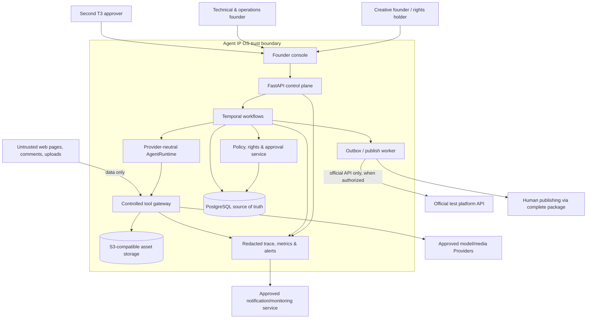

# System context and trust boundaries

- Status: Ready for founder review
- Version: 0.1
- Related: [MVP PRD](../product/prd-mvp.md), [content lifecycle](../specs/content-lifecycle.md), [data model](data-model.md)

## Context

## Component responsibilities

| Component | Owns | Must not own/do |
|---|---|---|
| Founder console (`apps/web`) | Human inspection, comparison, approval/revision/rejection, stop controls, package download, operations views | Business truth, direct platform tokens, client-side authorization decisions |
| Control plane (`apps/api`) | Authenticated commands/queries, validation, resource authorization, response schemas | Long-running orchestration or unguarded side effects |
| Temporal workflow (`packages/workflows`) | Durable progression, timers, retry/cancel/wait, signals, compensation coordination | Authoritative content bytes, rights truth, or model-only decisions |
| AgentRuntime (`packages/agent_runtime`, `packages/agents`) | Structured cognitive tasks, model routing, bounded tool loop, schema validation, cost/source/prompt/model metadata | Platform publication, secrets, payments, durable workflow state |
| Tool gateway (`packages/tools`) | Server-side identity/scope/resource/state/budget validation; controlled Provider/media/search functions | Trusting Prompt declarations as authorization; exposing raw credentials |
| Policy engine (`packages/policy_engine`) | Fact/rights/risk reports, R0–R4 routing, approval snapshots/validity, fail-closed rules | Rewriting candidate content after approval |
| Platform adapters (`packages/platform_adapters`) | Capability declaration, official OAuth/brokered requests, upload/create/query/reconcile, Mock/package fallback | Assuming capability not granted; Cookie/browser-simulated publishing |
| Media pipeline (`packages/media_pipeline`) | Deterministic template assembly, subtitle/disclosure, technical validation, asset derivations | Silent rights decisions or irreversible source deletion |
| PostgreSQL | Transactional domain truth, outbox, approvals, audit metadata, decisions/cost | Raw large media, platform plaintext credentials |
| Object storage | Immutable/versioned media, evidence snapshots, encrypted sensitive bucket, eventual WORM audit export | Relational workflow truth |
| Observability | Redacted trace/metrics/errors/cost alerts with ownership | Sensitive prompts, raw face/voice, token values, mutable audit truth |

## Trust boundaries and controls

1. **Human/browser → control plane:** authenticated session, CSRF protection, server authorization, MFA for production admin/T3, no security decision trusted from client fields.
2. **External data → Agent:** web pages/comments/uploads are untrusted data. They are typed, size/type/domain constrained, scanned/isolated where applicable, and cannot grant tools or alter instructions.
3. **Agent → tool gateway:** short-lived workload identity, explicit allowlist and schema, resource/workflow/budget checks, audit. An Agent never receives Provider/platform secrets.
4. **Workflow → side effect:** same-transaction candidate/approval/stop/budget validation creates intent/outbox; worker obtains short lease and rechecks before send.
5. **OS → Provider/platform:** only approved region/service/account/Scope; TLS and official SDK/API; test allowlist and environment switch; rate/error mapping; signed webhooks before state changes.
6. **Ordinary → sensitive storage:** portrait/voice originals reside in a separate encrypted bucket and access path; ordinary trace/search/test storage never receives them.

## Logical runtime and deployment boundary

The MVP is a modular monolith deployed as a small set of processes: web console, API, Temporal worker(s), and media worker, backed by PostgreSQL, Temporal service, and S3-compatible storage. Module boundaries are code and schema boundaries, not network microservices. Local development uses Docker Compose after M0-05; production topology is deliberately not selected in M0.

Redis, pgvector, full Prometheus/Grafana, Kubernetes, Kafka, and a data warehouse are not MVP prerequisites. If a cache is introduced later, it cannot become a business source of truth.

## Degraded operation

- No approved Provider: use deterministic behavioral Mock Providers and label all output synthetic.
- No platform Scope: create complete publish packages and manual post/metric evidence; do not fake API success.
- No second T3 approver/MFA: keep T3 production tools disabled.
- No valid rights/fact/policy evidence: quarantine or request revision.
- Unknown platform result: reconcile or wait for human evidence; never auto-republish.
