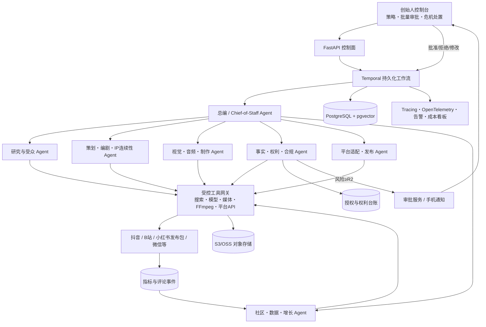

# AI超级IP全 Agent 公司技术方案（V1.1）

**版本日期：** 2026年8月19日  
**目标：** 两名创始人＋一套可审计的 Agent 系统，完成选题、研究、创作、制作、审核、发布、互动、分析和商业化  
**设计边界：** 中国大陆内容平台；优先使用官方接口；极少人工决策；不以规避平台或服务商规则为技术前提

---

## 一、结论：应该搭建什么

建议搭建一个“AI内容公司的操作系统”，而不是一组互相聊天的机器人。系统由五层组成：

1. **控制台：** 两位创始人查看选题、素材、审批、日历、预算和数据；
2. **确定性流程层：** 负责状态、定时、重试、并发、审批等待、超时、回滚和审计；
3. **Agent认知层：** 负责研究、判断、写作、视觉策划、适配、质检和复盘；
4. **工具执行层：** 调用搜索、知识库、图像/视频/音频、FFmpeg、平台官方API和数据接口；
5. **资产与记忆层：** 保存IP圣经、素材、授权、版本、提示词、发布记录、指标和决策。

关键原则是：**流程引擎决定“下一步何时发生”，Agent决定“这一步应当产出什么”，工具层决定“动作怎样可靠执行”。** 不让模型独自承担定时、权限、付款、重复发布判断或数据一致性。

正式目标不是100%无人，而是：

- 低风险内容从研究到发布可全自动；
- 每周只需要一次20—30分钟批量决策；
- 新的人脸/声音合成、商单、合同、付款和危机事件按单审批；
- 系统故障、权利不清或合规不确定时自动停止，不自行“猜测后继续”。

### 单人实施范围

20个岗位是目标组织设计，不是12周内全部实现的承诺。由1名技术负责人实施时，前12周只交付6个合并运行单元、短图文/一种30秒视频、所有内容人工终审、一个已获权平台适配器（若外部权限按时获批）和其他平台发布包。CRM、自动评论、财务Agent、长内容、完整多Provider切换和R1无人发布放到后续版本。功能冻结后另设4周稳定运行期，不能把“第9—12周开发”和“连续4周稳定”同时计算。

---

## 二、重要前提与部署限制

### 1. 模型供应商必须可替换

系统不能把业务状态绑定在某一家模型厂商的对话ID中。统一定义五类Provider接口：

- `TextModelProvider`：文本、多模态理解、工具调用和结构化输出；
- `EmbeddingProvider`：知识库检索；
- `ImageProvider`：图像生成与编辑；
- `VideoProvider`：视频生成；
- `AudioProvider`：转写、TTS及在合法授权下的声音能力。

每个Provider至少实现：请求、异步查询、取消、费用回传、内容凭证、错误分类和限流处理。模型和媒体服务可以混用，业务层只接收统一的结构化结果。

### 2. OpenAI的适用说明

若部署主体和服务使用地点符合OpenAI官方支持范围，可用Responses API与Agents SDK实现Agent循环、工具、审批和追踪。官方文档建议：主Agent需要掌握最终结果时，采用“manager＋agents as tools”；需要专家接管用户交互时，才使用handoff。本项目属于前者，由“总编Agent”保持最终控制。[OpenAI编排文档](https://developers.openai.com/api/docs/guides/agents/orchestration)

但是，截至本方案日期，OpenAI官方API支持国家/地区列表未列出中国大陆和香港，并明确提示从未列出的地区访问或提供访问可能导致账号被封禁或暂停。因此，中国大陆部署不应依赖代理或其他规避方式；应使用在部署地合法可用的国内持牌服务、自托管模型，或由符合支持范围和法律要求的独立境外主体部署相应服务。[OpenAI支持国家和地区](https://developers.openai.com/api/docs/supported-countries)

因此，本方案以**供应商中立的业务编排**为主；OpenAI Agents SDK是合规可用地区的一种Agent运行时实现，不是系统不可替换的地基。

### 3. 不把实验性多Agent作为核心状态机

OpenAI Responses API的Multi-agent能力目前标记为beta，适合并行研究等独立工作；官方也提示，当任务依赖单一顺序、频繁写共享状态或主要受单个外部慢操作限制时，增加子Agent未必有利。本项目只在“多来源研究、多个创意方向、多个平台文案”等无共享写冲突的步骤使用模型内并行，核心发布流程由代码和工作流引擎控制。[OpenAI Multi-agent文档](https://developers.openai.com/api/docs/guides/responses-multi-agent)

---

## 三、总体技术架构



### 推荐技术栈

| 层 | 推荐选型 | 为什么 |
|---|---|---|
| 前端控制台 | Next.js＋TypeScript | 审批、日历、版本对比、数据看板生态成熟 |
| API控制面 | Python 3.12＋FastAPI＋Pydantic | 与Agent/媒体生态一致，结构化Schema清晰 |
| 持久化工作流 | Temporal | 支持长流程、定时、重试、人工Signal和断点恢复；配合幂等键实现业务级去重 |
| Agent运行时 | 自建`AgentRuntime`接口；合规地区可接OpenAI Agents SDK | 避免供应商锁定，同时保留工具、guardrail和trace能力 |
| 主数据库 | PostgreSQL 16＋pgvector | 事务数据、JSON、检索和小规模向量库统一 |
| 缓存/限流 | Redis | 分布式锁、速率限制和短期缓存；不要作为业务真相源 |
| 资产存储 | S3兼容存储（本地MinIO，生产OSS/COS/S3） | 原图、音频、视频和中间文件不可放数据库 |
| 媒体流水线 | FFmpeg＋ffprobe＋模板渲染器 | 分辨率、码率、字幕、片头AI标识等确定性处理 |
| 可观测性 | OpenTelemetry＋Sentry＋Prometheus/Grafana | 跨服务追踪、错误和成本告警 |
| 密钥 | 云Secret Manager/KMS | Agent永远不能直接读取平台Token和主密钥 |
| 部署 | Docker Compose开发；生产使用托管Postgres、对象存储和容器平台 | 单人维护可控，后续可横向扩展 |

MVP不引入Kafka、Kubernetes或独立数据仓库。单人首版只运行FastAPI、Temporal、PostgreSQL、对象存储和一个简单控制台；Redis、pgvector、Prometheus/Grafana完整栈以及多Provider全量实现按实际需要延后。错误先接一个托管监控服务，核心运行指标存PostgreSQL。Temporal承担工作流与任务队列；内容量与账号数达到明显规模后再拆分。

---

## 四、Agent岗位设计

这些是“逻辑岗位”，不是常驻进程。总编只在需要时调用岗位；同一个低成本模型可以承担多个低风险岗位，高价值步骤再路由到强模型。

12周MVP将岗位合并为6个运行单元：规划研究（A00+A01+A03）、创作（A04+A05+A06）、媒体制作（A07+A08）、最终核验（A09+A10+A11）、平台候选/发布（A12+A13）和基础分析（A15）。其余岗位保留接口与数据结构，不在MVP实现。

| 编号 | Agent岗位 | 主要输入 | 必须输出 | 可使用工具 | 可写范围 |
|---|---|---|---|---|---|
| A00 | 总编/Chief of Staff | 内容目标、日历、预算、IP圣经 | `ExecutionPlan`、任务分派、最终候选 | 只读所有数据、调用其他Agent | 计划与任务，不直接发布 |
| A01 | 趋势研究 | 平台、日期、受众问题 | 有来源的`ResearchPack` | 搜索、平台趋势、历史数据 | 研究库 |
| A02 | 受众洞察 | 评论、私信标签、指标 | 人群问题、动机、反感点 | 数据库查询、聚类 | 洞察库 |
| A03 | 选题策略 | 研究、栏目、业务目标 | 10个选题及评分、风险、假设 | A01/A02作为工具 | 选题池 |
| A04 | IP圣经管理员 | 新设定、旧设定、创始人决策 | 冲突检查、变更提案 | 知识库、决策台账 | 仅可提案，批准后写入 |
| A05 | 编剧/文案 | 选题Brief、平台目标 | 脚本、镜头、标题、CTA | IP库、事实材料 | 草稿版本 |
| A06 | 创意总监 | 多个脚本与视觉方向 | 选择理由、视觉Brief、退修意见 | A05、多模型并行 | 创意决策草案 |
| A07 | 视觉提示与分镜 | 视觉Brief、角色一致性资料 | 提示词、参考图、镜头清单 | 图像/视频Provider | 媒体任务 |
| A08 | 媒体制片 | 素材、分镜、模板 | 可发布视频/图文包、技术报告 | 图像/视频/音频、FFmpeg | 资产库 |
| A09 | 事实核验 | 文案中的可核验主张 | 逐条证据、置信度、需删除项 | 搜索、知识库 | 核验报告 |
| A10 | 权利与来源 | 每项素材、模型、音乐、字体 | `RightsManifest`、缺失权利项 | 授权台账、资产元数据 | 权利台账状态 |
| A11 | 合规与品牌安全 | 全部成品、平台、商业关系 | 风险等级、规则命中、标识清单 | 规则库、A09/A10 | 风险报告；可阻断 |
| A12 | 平台改编 | 核心成品、平台规范 | 各平台标题、封面、标签、时长版本 | 模板库、平台规范 | 发布候选 |
| A13 | 发布调度 | 已通过候选、计划时间 | `PublishJob`与结果 | 仅官方平台适配器 | 发布记录；不得改内容 |
| A14 | 社区运营 | 评论事件、FAQ、用户分层 | 回复/隐藏/升级建议 | 评论接口、CRM | 低风险回复或待审队列 |
| A15 | 数据分析 | 内容指标、成本、实验组 | 日/周报、异常、归因假设 | SQL只读、统计工具 | 分析结果 |
| A16 | 增长实验 | 历史结果、素材版本 | 下一轮A/B实验方案 | A15、内容库 | 实验定义 |
| A17 | 商务/CRM | 商机、品牌资料、报价规则 | 线索评分、提案草稿、跟进任务 | CRM、知识库 | 草稿；不能签合同 |
| A18 | 财务控制 | 调用费、制作费、收入 | 成本报告、预算预警 | 账目只读、Provider账单 | 预算状态；可暂停任务 |
| A19 | SRE/质检 | 失败任务、延迟、错误率 | 根因分类、重试/隔离建议 | 日志、trace、健康检查 | 工单；不能改生产配置 |

### 每个Agent必须具备的“岗位合同”

每个Agent配置文件都必须包含：

```yaml
id: A11
name: compliance_reviewer
purpose: 对发布候选进行事实、人格权、AI标识、广告和平台风险分级
input_schema: ContentReviewInput@v1
output_schema: RiskDecision@v1
model_tier: balanced
tools: [read_policy, read_rights_manifest, read_fact_report]
read_scopes: [content, rights, policies]
write_scopes: [risk_reports]
forbidden_actions: [publish, delete_asset, reply_comment, spend_money]
max_tool_calls: 12
max_cost_cny: 3.00
timeout_seconds: 180
retry_policy: {max_attempts: 2, retry_on: [timeout, rate_limit]}
escalate_when: [risk_score_gte_60, missing_consent, policy_conflict]
prompt_version: A11-2026-08-01
```

工具权限必须在服务端验证，不能仅写在Prompt里。模型即使请求`publish()`，只要Agent角色没有权限，工具网关就返回拒绝。

---

## 五、全流程状态机

### 1. 父子状态机

父级`ContentUnit`只表达源内容进度；每个平台版本都是独立的`PlatformCandidate`，拥有自己的审核、审批、发布、下架和申诉状态。不能用一条线性状态表示“抖音成功、B站失败、小红书待人工”。

```text
PLANNED
  → RESEARCHING
  → BRIEF_READY
  → DRAFTING
  → CREATIVE_QA
  → ASSET_GENERATION
  → MEDIA_ASSEMBLY
  → PLATFORM_ADAPTATION
  → [每个平台创建不可变 PublishCandidate]
      → FACT_CHECK
      → RIGHTS_CHECK
      → COMPLIANCE_CHECK
      → RISK_ROUTING
          ├─ R0/R1 → READY_FOR_APPROVAL_OR_AUTOMATION
          ├─ R2/R3 → WAITING_APPROVAL → APPROVED / REVISION / REJECTED
          └─ R4 → QUARANTINED
      → SCHEDULED
      → PUBLISHING
      → PUBLISHED
      → MONITORING
      → TAKEDOWN_PENDING → REMOVED / TAKEDOWN_FAILED / APPEALED
  → LEARNING
  → ARCHIVED
```

任何状态都可进入`RETRY_WAIT`、`FAILED`或`QUARANTINED`。失败不能退回“未知”，必须保存错误代码、输入版本、Agent版本、工具调用和已产生资产。

### 2. 一条内容如何自动完成

1. Temporal Schedule在每周固定时间创建内容批次；
2. A01、A02并行研究趋势与用户问题；
3. A03产生选题并用“品牌契合、受众需求、可制作、商业价值、风险、重复度”评分；
4. A00自动选择阈值以上的3个选题，或进入每周批量审批；
5. A05生成3个脚本，A06选择并提出一次修改；最多两轮，防止Agent互相空转；
6. A07/A08生成图像、视频、配音和母版；FFmpeg做确定性拼接、字幕和技术检查；
7. A12先生成每个平台的最终标题、文案、封面、标签和音视频文件，形成不可变`PublishCandidate`；
8. A09逐条核验最终候选中的事实，A10对最终资产依赖闭包检查权利，A11逐平台检查AI标识、人格权、广告和平台风险；来源缺失、过期或结论为未知时默认阻断；
9. 风险路由器决定自动发布、批量审批、逐条审批或隔离；审批必须绑定候选哈希；
10. A13按官方API能力发布并验证平台返回ID；
11. 完整版可由A14处理低风险评论；MVP只分类不自动回复。A15采集24小时、72小时和7日指标；
12. 完整版由A16把结论写入下一轮实验，不直接篡改IP圣经或长期策略。

### 3. 防止重复发布与审批后换包

每个发布动作使用：

```text
candidate_hash = sha256(canonical_json({title, caption, sorted_tags, ordered_asset_hashes,
                                        platform, account_id, policy_version}))
publish_intent_id = uuid7()
request_fingerprint = sha256(candidate_hash + platform + account_id + schedule_slot)
```

审批快照绑定`candidate_hash`、事实报告哈希、权利清单哈希、风险报告哈希、风险规则版本、审批人、审批有效期和账号；哈希基于字段排序、Unicode/时间/空值规则固定的规范化JSON计算。任何字、图、音视频、核验报告或规则变化都会使审批失效。发布使用PostgreSQL transactional outbox：在同一事务中原子校验候选哈希、审批、全局/账号停发标志和预算，再创建`publish_intent`。Worker执行前再次校验短时“可发布租约”。

平台适配器记录上传会话、平台草稿ID、请求指纹和每次尝试。发生“上传成功但响应丢失”时，先按平台可用能力对账；无法确认时转人工，禁止自动重发。同一内容未来合法重发必须创建新的`publish_intent_id`和明确的重发原因。

---

## 六、把人工参与压缩到最少

### 风险分级

| 等级 | 典型内容 | 默认行为 | 人工参与 |
|---|---|---|---|
| R0 内部 | 研究、草稿、模拟数据 | 自动运行 | 无 |
| R1 低风险 | 预批准栏目、已授权真人素材、无商业主张、无新的人脸/声音合成 | 完整版可自动；MVP仍强制终审 | MVP逐条审批；稳定后每周抽检10% |
| R2 中风险 | 新栏目、重要观点、较强情绪表达、热点借势 | 等待每周批量审批 | 一次批准一批 |
| R3 高风险 | 新的人脸/声音克隆、虚拟亲密、商单、价格/效果承诺、合同、付款、私信转化 | 单项暂停 | 本人或双方逐项审批 |
| R4 禁止 | 无授权脸声、权利不清、违法违规、欺骗性互动、无法验证的高风险主张 | 自动隔离 | 只能拒绝或重做 |

### 实际人类节奏

- **每季度60分钟：** 更新IP圣经、授权边界、禁区和预算；
- **每周20—30分钟：** 批准下周栏目、R2选题与可使用素材包；
- **每项1—3分钟：** 只审批R3内容；
- **随时：** 危机、网暴、账号异常、法律通知和超预算事件。

“减少人工”通过**预批准的内容模板、素材库和权限范围**实现，而不是默认永久授权。主角可一键触发全局停发；它保证阻止尚未向平台提交的新请求。平台已经受理的上传、审核或发布无法被本地系统瞬间撤销，必须进入对账、取消（若平台支持）或逐平台下架流程。

MVP阶段所有对外内容仍需最终审批。只有完成100条评测、4周稳定期以及审批/停发竞争测试后，才允许R1自动发布。T3动作使用两位创始人双人审批和MFA；审批超时默认拒绝，不采用“超时即通过”。

OpenAI官方Agent文档将guardrail用于自动验证，将human-in-the-loop用于具有副作用或敏感工具的审批；并提醒Agent级guardrail不覆盖每一个深层工具调用，因此发布、删除、付款等工具自身也要有服务端guardrail。本方案按这一原则把检查放在每个有副作用的工具旁。[Guardrails与人工审批](https://developers.openai.com/api/docs/guides/agents/guardrails-approvals)

---

## 七、核心数据与知识架构

### 1. 不能只靠向量库的四种记忆

| 记忆 | 保存内容 | 存储方式 | 谁能修改 |
|---|---|---|---|
| 规范记忆 | IP定位、语气、人物设定、禁区、平台规则 | 版本化结构文档＋PostgreSQL | 仅批准流程 |
| 语义记忆 | 历史内容、评论、研究、品牌资料 | pgvector＋对象存储 | 采集任务；有来源 |
| 情节记忆 | 小说/短剧人物、时间线、伏笔、已发生事件 | 知识图谱式关系表＋文本 | A04提案，人工/规则批准 |
| 经验记忆 | 哪些选题、封面、开头有效 | 指标表、实验表 | 数据管道自动写 |

向量检索结果永远是“参考”，不是权利和事实真相。授权范围、预算、发布状态、账号Token和合同必须读事务表。

### 2. 最小数据表

```text
ip_projects
ip_bible_versions
content_units
content_versions
content_tasks
agent_configs
agent_runs
tool_calls
artifacts
artifact_derivations
asset_rights
consent_grants
fact_claims
risk_reports
approval_requests
approval_snapshots
platform_accounts
platform_candidates
publish_intents
publish_jobs
publish_attempts
platform_posts
takedown_jobs
comment_events
metric_snapshots
experiments
cost_ledger
decision_log
audit_events
```

每个产物至少带：`project_id`、`content_id`、`version`、`created_by_agent`、`prompt_version`、`model_provider`、`model_id`、`source_ids`、`rights_status`、`risk_level`、`created_at`和内容哈希。

`artifact_derivations`保存原始素材→裁剪→配音→模板→母版→平台文件的有向依赖图。发布前对最终候选做闭包检查，只有所有叶子素材都存在有效权利证据才能通过；撤权时沿依赖图取消未发布任务，并为每个已发布平台帖子创建下架任务。

### 3. 结构化输出

Agent之间不传自由文本作为唯一接口。关键输出必须使用JSON Schema/Pydantic，例如：

```python
class PublishCandidate(BaseModel):
    content_id: UUID
    version: int
    platform: Literal["douyin", "bilibili", "xiaohongshu_pack"]
    title: str
    caption: str
    hashtags: list[str]
    asset_ids: list[UUID]
    ai_disclosure: str
    fact_report_id: UUID
    rights_manifest_id: UUID
    risk_level: Literal["R1", "R2", "R3", "R4"]
    scheduled_at: datetime
```

所有Schema版本化；字段变化先做数据库迁移和兼容测试，不能让某个Agent临时“多输出一段话”破坏流水线。

---

## 八、媒体生产技术方案

### 1. 图文

- 从批准的风格模板生成`VisualBrief`；
- 图像Provider返回原图、模型、参数、内容凭证和费用；
- 一致性Agent只比较角色、服装、色彩和构图，不擅自修改脸部；
- 模板渲染器加入标题、合法字体、AI标识和安全边距；
- OCR检查错字，图像相似度检查重复和异常；
- 输出原图、发布图、缩略图和权利清单。

### 2. 短视频

- 编剧输出镜头级JSON，不直接生成一段不可控长视频；
- 每个镜头独立生成/拍摄，失败只重做单镜头；
- FFmpeg负责剪辑、转场、码率、音轨混合、字幕、封面帧和AI标识；
- `ffprobe`自动检查时长、分辨率、帧率、响度、黑帧、静音和文件大小；
- 视觉质检Agent抽取关键帧，检查人物漂移、手部异常、文字乱码、暴露和品牌标识；
- 输出母版、平台版、字幕文件、封面、镜头清单和生成记录。

### 3. 声音与歌曲

- 默认使用已获商业许可的合成音色，不默认克隆真人声音；
- 真人声音克隆属于R3：单独授权、限定用途/期限/平台、保存撤回和删除记录；
- 歌曲需分开记录歌词、旋律、伴奏、音色和训练素材的权利来源；
- 任何“仿佛真人说过”的合成内容必须清晰披露，不把AI声音用于私信、客服承诺或合同确认。

### 4. 长内容

小说、剧本和长片采用层级结构：`SeriesBible → SeasonArc → EpisodeOutline → Scene → Shot`。每一级先过连续性和事实/权利检查再向下生成，避免一次性生成十万字或百分钟视频导致设定漂移。长任务可使用供应商的后台异步能力；例如OpenAI Responses API支持`background=true`并可通过轮询或Webhook获取完成事件。[后台模式](https://developers.openai.com/api/docs/guides/background)、[Webhooks](https://developers.openai.com/api/docs/guides/webhooks)

---

## 九、平台发布接入方案

### 1. 统一平台适配器

```python
class PlatformAdapter(Protocol):
    capabilities: PlatformCapabilities
    async def validate(self, candidate): ...
    async def upload_asset(self, asset): ...
    async def publish(self, candidate, idempotency_key): ...
    async def get_post(self, platform_post_id): ...
    async def fetch_metrics(self, since): ...
    async def fetch_comments(self, since): ...
    async def reply_comment(self, comment_id, text): ...
    async def refresh_token(self): ...
```

每个适配器声明自己是否支持图片、视频、定时、评论、回复、数据和删除。业务层不能假设所有平台能力一致。

平台自动发布是外部能力，不是固定日期必然可交付。第0阶段必须先取得测试账号、确认具体Scope，并完成一次最小上传/草稿探针；未获权时，12周验收自动降级为完整发布包，不能为了赶进度改用Cookie或未许可浏览器自动化。

### 2. 当前接入判断

| 平台 | 当前建议 | 自动化级别 | 说明 |
|---|---|---|---|
| 抖音 | 申请开放平台应用、内容发布权限和用户OAuth | 获批后可自动上传/创建，发布后仍经过平台审核 | 官方文档提供图片/视频直接发布方案；权限需申请并获用户授权。[抖音内容发布方案](https://open.douyin.com/platform/resource/docs/ability/content-management/douyin-publish-solution/)、[创建视频API](https://developer.open-douyin.com/docs/resource/zh-CN/dop/develop/openapi/video-management/douyin/create-video/video-create) |
| 哔哩哔哩 | 申请开放平台开发者与视频管理能力 | 获批后可发布、删除、查询和取数据 | 官方开放平台列出视频稿件发布、删除、查询及数据能力；接入资格和授权以审核结果为准。[B站开放平台](https://openhome.bilibili.com/doc) |
| 小红书 | MVP生成完整“发布包”并提醒人工在App发布 | 半自动 | 本次未从官方公开文档核验到面向普通创作者的通用内容发布API；不得用未获许可的网页模拟点击代替官方接口。若后续获得正式接口，再实现适配器。 |
| 微信/其他 | 在取得正式账号类型、权限和官方文档后接入 | 逐项确认 | 先输出草稿/发布包，避免用非官方Cookie脚本。 |

### 3. 为什么不默认用浏览器自动发

浏览器自动化容易受验证码、风控、页面变化和账号安全影响，也可能违反平台规则。它只能用于内部预览或在平台明确许可的场景。生产发布优先级必须是：**官方API > 官方分享/草稿能力 > 人工最后一步 > 放弃该自动化**。

### 4. Token与账号安全

- OAuth Token由`Credential Broker`保存并加密，Agent只能调用“发布工具”，看不到Token；
- 不共用个人密码，不把Cookie写入数据库或Prompt；
- Token刷新、撤权和权限变更写入审计日志；
- 平台返回账号异常、权限不足或连续3次审核失败时，全账号自动暂停；
- 生产账号和测试账号分离，先在沙盒/测试账号验证。

---

## 十、社区运营与销售自动化

### 1. 评论处理

评论事件进入：去重 → 垃圾/辱骂/问题/夸赞/购买意向分类 → 风险评分 → 处理。

- R1常见问题：从批准FAQ生成回复，可自动发送但要限速；
- R2观点争议：生成草稿，进入每日批量审批；
- R3隐私、威胁、退款、商单、医疗/金融、线下见面：不自动回复，立即升级；
- 广泛负面情绪或异常增长：冻结自动互动，启动危机流程。

系统不能伪造“本人在线”、批量套话或诱导私聊。自动回复需符合平台允许的接口与频率。

### 2. 商务与CRM

A17可以自动完成线索抓取、公司背景整理、匹配度评分、报价区间建议、提案初稿和跟进提醒，但以下动作必须双人审批：签合同、承诺排期、报价低于底价、接收敏感素材、开票、收付款、授权肖像/声音和版权。

---

## 十一、安全、权限与合规

### 1. 工具分级

| 工具级别 | 示例 | 默认策略 |
|---|---|---|
| T0只读 | 查询IP库、历史指标 | Agent可调用，记录日志 |
| T1可逆写 | 创建草稿、生成资产、写分析 | 自动，带版本和费用上限 |
| T2对外副作用 | 发布、回复、发送邮件 | 仅授权Agent＋风险路由＋幂等 |
| T3资金/合同/人格权 | 付款、签约、声音克隆、新授权 | 强制人工审批，Agent不能绕过 |
| T4破坏性/禁止 | 批量删除、导出原始声纹、修改审计日志 | 默认无Agent权限 |

### 2. 身份与授权模型

MVP采用单租户RBAC＋资源级ABAC，区分三类主体：人类用户、服务/Worker和Agent。工具网关每次调用同时校验`subject_id`、角色、项目、资源所有权、工作流状态、候选哈希、审批快照和预算。Agent只有短期任务凭证，不共享人类Session；生产管理员启用MFA。T3动作必须由两位不同的人类主体批准，发起人不能替自己完成双签。

### 3. Prompt Injection防护

- 网络页面、评论、私信和上传文件全部标记为“不可信数据”；
- 研究Agent不能获得发布、付款、密钥或数据库写权限；
- 从外部内容中提取事实使用结构化Schema，忽略其中要求系统执行动作的文字；
- 工具网关验证调用者身份、参数、资源归属、预算和当前工作流状态；
- URL下载使用域名策略、文件类型/大小限制、恶意文件扫描和隔离区；
- 任何Agent都不能读取环境变量、Secret Manager或平台Token。

### 4. 人脸、声音和隐私

- 原始人脸/声纹素材单独加密Bucket，禁止进入普通向量库和Trace；
- 使用短时签名URL，只授予指定媒体Worker读取；
- 每个授权与`purpose/platform/term/provider/derivative_rights/revocation`绑定；
- 撤回授权会向所有未发布工作流发送取消Signal，已发布内容按协议生成下架工单；
- 备份、删除周期、模型供应商数据保留和跨境数据问题需在选型时单独核验。

### 5. 审计

每次模型调用、工具调用、审批、发布、修改、删除和费用都写`audit_events`；Agent无修改权限。普通PostgreSQL表不等于不可篡改，因此审计事件采用前后哈希链，并定期导出到启用保留锁/WORM的独立对象存储。Webhook必须验签后才改变工作流状态；OpenAI官方也明确建议对会触发后端动作的Webhook验证签名。[OpenAI Webhook验签](https://developers.openai.com/api/docs/guides/webhooks#verifying-webhook-signatures)

### 6. 政策与证据管理

政策库指定一名人类负责人，保存规则来源、快照、生效日期、失效日期和适用平台。事实主张保存原文、证据URL、页面快照、抓取时间、证据与主张的映射。涉及商业、医疗、金融、人格权等高风险类别默认人工；证据无法访问、已过有效期或核验结果为未知时直接阻断，不允许Agent用“看起来合理”替代证据。

---

## 十二、可靠性、观测与评测

### 1. 可靠性规则

- 可重试：超时、429、暂时网络失败，指数退避＋随机抖动；
- 不可自动重试：授权不足、内容违规、权利缺失、参数不合法；
- 每个活动设置超时、最大尝试、费用上限和熔断器；
- 失败3次进入死信/隔离队列并通知；
- 视频生成任务可取消；上游内容被拒绝时立即取消下游昂贵任务；
- 每日做数据库备份，每周恢复演练，资产启用版本和生命周期策略。

### 2. 可观测性

每条内容一个`trace_id`，串联：研究 → Agent调用 → 工具 → 资产 → 审批 → 发布 → 指标。面板至少显示：

- 成功率、平均周期、P95耗时；
- 每条内容模型/图片/视频/人工成本；
- 各Agent退修率和结构化输出失败率；
- 权利/事实/合规阻断数量；
- 平台发布成功率、审核失败率和重复发布数；
- 自动化率、人工审批数与平均响应时间。

若平台未开放指标读取权限，操作者可登记平台帖子ID并按24小时、72小时、7日录入指标截图/数值；Trace必须注明`manual_metric`及录入人。没有API权限时允许以这一降级方式验收，不能伪造自动采集成功。

MVP生产SLO：工作流状态不丢失；发布重复数为0；停发信号到新发布阻断P95≤5秒；R3/R4越权发布为0；平台发布尝试100%可追溯。达到阈值时自动停发并生成处置工单，不能只发一个没人负责的告警。

若合规使用OpenAI Agents SDK，其内置Tracing可记录模型调用、工具调用、handoff和guardrail；涉及敏感数据时关闭敏感输入输出记录或自建脱敏Trace。[OpenAI可观测性文档](https://developers.openai.com/api/docs/guides/agents/integrations-observability)

### 3. 上线前评测集

建立至少100条金标案例：

- 20条符合品牌语气；
- 20条事实真假与证据完整性；
- 20条肖像、声音、版权和广告风险；
- 20条平台适配；
- 10条Prompt Injection；
- 10条失败恢复与重复发布。

每次修改Prompt、Agent工具、模型或规则，都跑回归评测。上线门槛：结构化Schema成功率≥99%；发布幂等测试0重复；R3/R4案例在发布前全部被阻断；任何关键安全漏判均阻止版本上线。创意质量可用相对评分，但安全项不能用“平均分不错”掩盖单个严重错误。

---

## 十三、代码仓库结构

```text
agent-ip-os/
├─ apps/
│  ├─ api/                    # FastAPI控制面
│  ├─ web/                    # Next.js控制台
│  └─ worker-media/           # FFmpeg/媒体Worker
├─ packages/
│  ├─ agent_runtime/          # AgentRuntime抽象与Provider适配
│  ├─ agents/                 # A00-A19岗位定义、Prompt、Schema
│  ├─ workflows/              # Temporal工作流与Activities
│  ├─ tools/                  # 搜索、知识库、平台、媒体工具
│  ├─ platform_adapters/      # Douyin/Bilibili/发布包
│  ├─ policy_engine/          # 风险规则与审批路由
│  ├─ media_pipeline/         # 镜头、字幕、模板、ffmpeg
│  ├─ data_models/            # Pydantic与DB模型
│  └─ evals/                  # 金标集和回归测试
├─ config/
│  ├─ agents/
│  ├─ platforms/
│  ├─ policies/
│  └─ templates/
├─ migrations/
├─ infra/
│  ├─ docker-compose.yml
│  └─ deployment/
├─ tests/
│  ├─ unit/
│  ├─ integration/
│  ├─ workflow/
│  └─ platform_sandbox/
└─ docs/
   ├─ ip-bible/
   ├─ rights/
   ├─ runbooks/
   └─ architecture/
```

Prompt必须像代码一样进入版本控制、评审和回归测试；生产环境只引用已发布的Prompt版本。

---

## 十四、12周窄版MVP＋4周稳定期

### 第0阶段：第1—2周——风险消除与垂直切片

交付：

- 确认部署地区、可用模型/媒体供应商和平台开发者资格；
- 创建仓库、Docker Compose、PostgreSQL、对象存储、Temporal、FastAPI和最简审批页；
- 建立`content_units`、`agent_runs`、`artifacts`、`rights`和`audit_events`；
- 完成IP圣经V1、授权模板、风险分级和“一键停发”；
- 取得至少一个平台测试账号/Scope并完成一次最小上传或草稿探针；如未获权，确认发布包降级路径；
- 所有平台只使用测试账号，不对外发布。

验收：一个测试候选从生成→候选哈希→终审→outbox→测试发布/发布包完整走通；停发标志能阻断在途Worker；重启后工作流能继续；密钥不出现在日志和数据库明文字段。

### 第1阶段：第3—6周——内容工厂MVP

实现6个合并运行单元：规划研究、创作、媒体、最终核验、平台候选/发布、基础分析：

- 定时产生3个选题；
- 生成脚本、图文和30秒短视频母版；
- 自动事实/权利/风险检查；
- 生成抖音、小红书、B站发布包；
- 控制台可批量批准、退修、拒绝和下载发布包。

验收：连续生成20条测试内容；没有孤儿资产；每条均有来源、资产血缘、权利、风险、成本和版本；最终发布候选经过逐平台检查；R3案例全部暂停。

### 第2阶段：第7—10周——单平台发布与数据闭环

- 从抖音或B站中选择一个已获权平台，完成OAuth、上传/发布/查询适配器；
- 其余平台输出发布包＋手机提醒；
- 加入基础指标采集、每日/周报和预算熔断；评论只采集/分类，不自动回复；
- 实现幂等、Token刷新、审核失败和账号暂停。

验收：测试账号连续两周无重复发布；平台失败能恢复或隔离；撤销账号授权后所有发布立即停止。

### 第3阶段：第11—12周——功能冻结与安全验收

- 建立100条金标评测与版本发布门；
- 所有内容仍需最终人工审批；
- 完成故障、误发、授权撤回、下架、权利投诉、停发竞争和Token泄露演练；
- 冻结功能与Prompt版本，进入独立稳定期。

验收：金标与工作流测试通过；无重复发布、无越权工具调用、无未授权脸声进入发布队列；所有发布均绑定最终候选哈希和有效审批。

### 第4阶段：第13—16周——独立稳定运行

不新增主要功能，连续4周运行并修复问题。达到SLO、100条评测无关键漏判、停发/下架演练通过后，才开启少量R1自动发布并逐步扩大。CRM、自动评论、财务Agent、长内容和第二个正式平台放入16周后的Backlog。

---

## 十五、成本与容量控制

不要按“Agent数量”预算，而按“内容单元×步骤调用”预算。每条内容记录：

```text
total_cost = text_tokens + search_calls + image_generations
           + video_seconds + audio_seconds + storage
           + platform_cost + human_minutes
```

三层模型路由：

- **Economy：** 分类、提取、标签、格式适配、评论聚类；
- **Balanced：** 研究、选题、脚本、复盘；
- **Premium：** 月度策略、核心世界观、长内容结构、重大争议复核。

成本规则：

- 每个Agent、内容和月度都有硬上限；
- 文本失败最多重试2次，媒体失败只重做失败镜头；
- 先用低分辨率预览，批准后才生成高质量成品；
- 相同IP圣经和模板启用Prompt缓存/本地缓存；
- 同一事实只研究一次并带有效期复用；
- 月预算达到70%预警；90%时只允许已批准的R1生产任务以及安全/恢复任务；100%时只允许安全与恢复任务。

初期基础设施可以控制在单台应用容器＋托管数据库/对象存储的量级，但视频生成费用可能远高于文本和服务器，必须单独设置“每周可生成秒数”而不是无限调用。

---

## 十六、你现在应按什么顺序搭建

1. **先确定合规Provider和部署地。** 若在中国大陆运营，选择在当地合法可用的模型/媒体服务；不要先写死OpenAI。
2. **注册平台开发者资格。** 先申请抖音、B站开放能力；资格审核与OAuth回调域名往往比写代码更慢。
3. **建立IP圣经与权利台账。** 没有这两项，Agent生成越快，风险积累越快。
4. **搭建PostgreSQL、对象存储和Temporal。** 先让一个虚拟内容任务可以跨重启恢复。
5. **只实现6个合并运行单元。** 先打通“选题→成品→最终平台候选→合规→终审→发布包”，不要一开始做20个岗位。
6. **用人工发布跑20条。** 验证内容和资产结构，再接平台API。
7. **接抖音/B站官方发布。** 完成幂等、Token、平台审核和查询后才允许定时发布。
8. **建立100条评测集并独立稳定4周。** 两者未完成，不开启R1自动发布。
9. **逐步降低人工。** 先R1自动、R2批审，R3始终逐条；每降低一个审批点，都必须有相同作用的自动guardrail和回滚能力。
10. **四周稳定后再做小说、歌曲和长片Agent。** 长内容不会修复短内容定位不清的问题。

### 12周窄版MVP的完成定义

当系统能做到以下全部事项，才算12周窄版MVP完成：

- 能按计划产生3条源内容并完成多平台版本；
- 每个内容都有事实、权利、AI标识、风险和成本报告；
- 所有发布候选绑定人工终审；R3/R4被阻断；
- 一个已获权平台走官方接口，其余平台输出可直接发布的完整包；若外部权限未获批，全部使用发布包；
- 评论仅自动采集/分类并生成回复草稿，MVP不自动发送任何回复；
- 任何任务可重试、取消、恢复且不会重复发布；
- 主角能一键停发并撤销未发布的人脸/声音任务；
- Prompt或模型升级前必须通过回归评测；
- 每条内容从选题到7日数据形成完整Trace和可复盘成本；无平台数据权限时允许带证据的人工录入。

达到以上标准后，系统具备安全的端到端骨架。再经过4周稳定期、评测和逐级放权，才能称为“极少人工参与的Agent内容公司”，而不是一套会自动生成文案的脚本。
