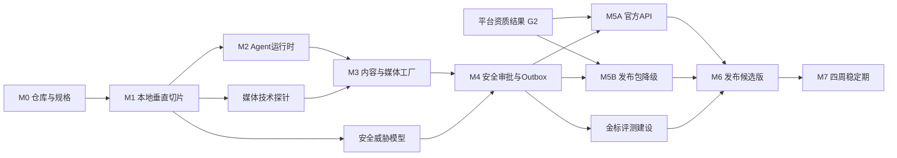

# AI超级IP系统：Codex开发执行计划（V1.0）

**版本日期：** 2026年8月19日  
**依据：** 《AI超级IP全 Agent 公司技术方案（V1.1）》  
**目标：** 由创始人负责产品、权限和上线决策，Codex承担绝大部分需求细化、编码、测试、文档、代码审查和本地交付工作，在12周内完成窄版MVP，再用4周完成稳定性验证。

---

## 一、先给结论：怎么让Codex真正把项目做出来

不要把整个项目交给一个持续数月的巨大聊天，也不要一次让Codex“把全系统写完”。正确方式是：

1. 先用2—3天固化仓库规则、架构决策、接口契约和验收标准；
2. 把12周项目拆成6个可独立演示的里程碑，每个里程碑再拆成0.5—2天的小任务；
3. 每个任务都让Codex执行“阅读规格→检查现状→实现→测试→自审→报告”的闭环；
4. 同一时间只允许一个任务修改同一模块；独立研究、测试和审查可交给子代理并行；
5. 每个里程碑都保留可运行版本，关键路径不得越过未通过的阶段门；只读研究和不写共享状态的技术探针可以提前进行；
6. 真实平台发布、云资源创建、密钥配置、付费调用和生产部署始终由人类明确授权；
7. 首版只做6个合并Agent、图文和一种30秒短视频、全部人工终审、一个官方平台适配器或发布包降级，不扩张到20个Agent。

Codex在这个项目中相当于“技术团队”，但不是公司法人、平台账号持有人或最终上线批准人。它可以完成代码和工程交付，不能替你取得平台资质、签署服务协议、提供真人肖像/声音授权、持有生产密钥或决定高风险内容是否发布。

---

## 二、双方职责

### 创始人需要做的事情

- 指定产品优先级和第一目标平台；
- 决定部署地、模型/媒体供应商和月预算；
- 注册云账号、域名、平台开发者账号并完成实名/企业认证；
- 把密钥放进密钥管理系统或本地环境变量，不在聊天中粘贴；
- 批准安装依赖、联网下载、创建云资源、数据库破坏性迁移、真实发布和生产部署；
- 提供IP圣经、真人素材授权、品牌禁区和最终内容审批；
- 在每个里程碑演示时作出“通过、退修或调整范围”的决定。
- 与另一位已登记审批人共同完成T3双签；两人均启用MFA，发起人不得自批，第二审批人缺席时默认拒绝。若MVP阶段没有第二位合格审批人，所有T3生产动作保持禁用。
- 人工确认100条金标案例中的品牌、事实、权利和风险标签；高风险权利/合规案例由第二位人类复核。

### Codex负责的事情

- 将商业目标转成PRD、用户故事、数据模型、API契约和验收用例；
- 初始化仓库、开发环境、数据库迁移、服务骨架和CI；
- 实现前端、后端、工作流、Agent运行时、媒体流水线、规则引擎和平台适配器；
- 编写单元、集成、工作流、端到端、安全和回归评测；
- 运行测试、修复缺陷、检查日志、更新文档和运行手册；
- 在每次任务结束时报告改动文件、测试证据、已知风险和下一步；
- 在获得明确批准后执行预发布部署和测试账号验证。

### 必须由人确认的6个决策门

| 决策门 | 最晚时间 | 人类要决定什么 | 未决定时如何降级 |
|---|---:|---|---|
| G0 项目边界 | 开工前 | MVP内容形态、目标用户、第一平台、16周不做清单 | 只实现本地发布包演示 |
| G1 部署与Provider结果 | 第1周 | 记录部署地区、文本/图像/视频供应商和预算是否已批准 | 未批准即进入M2B，全部使用Mock/契约实现 |
| G2 平台资质结果 | 第2周 | 记录抖音或B站是否已取得测试账号、应用、Scope和回调域名 | 未获权即进入M5B，不阻塞后续里程碑 |
| G3 产品验收 | 第6周 | 控制台、内容质量和审批流程是否合格 | 继续人工发布，不进入API发布 |
| G4 测试发布 | 第10周 | 是否允许测试账号执行官方API发布 | 只做上传模拟和契约测试 |
| G5 自动化放权 | 第16周 | 是否允许少量R1内容自动发布 | 保持所有内容人工终审 |

---

## 三、Codex项目应该怎样组织

当前目录只有商业和技术方案，尚未建立Git仓库。正式开发建议新建子目录`agent-ip-os/`，避免把策划资料和应用源码混在一起。

```text
Agent自媒体/
├─ AI超级IP双人公司商业计划书_v1.md
├─ AI超级IP全Agent公司技术方案_v1.md
├─ AI超级IP系统_Codex开发执行计划_v1.md
└─ agent-ip-os/
   ├─ AGENTS.md
   ├─ README.md
   ├─ DECISIONS.md
   ├─ BACKLOG.md
   ├─ docs/
   │  ├─ baseline/
   │  ├─ product/prd-mvp.md
   │  ├─ architecture/system-context.md
   │  ├─ architecture/data-model.md
   │  ├─ adr/
   │  ├─ specs/
   │  ├─ acceptance/
   │  └─ runbooks/
   ├─ apps/api/
   ├─ apps/web/
   ├─ apps/worker-media/
   ├─ packages/agent_runtime/
   ├─ packages/agents/
   ├─ packages/workflows/
   ├─ packages/policy_engine/
   ├─ packages/platform_adapters/
   ├─ packages/media_pipeline/
   ├─ packages/data_models/
   ├─ packages/evals/
   ├─ config/
   ├─ migrations/
   ├─ infra/
   └─ tests/
```

### `AGENTS.md`必须先写

Codex会在开始工作前读取`AGENTS.md`；根目录规则可由子目录中的规则进一步细化。项目根规则至少包含：

- 产品范围：12周只做6个合并Agent、图文、30秒视频、终审和一个平台；
- 架构原则：Temporal保管流程状态，PostgreSQL是业务真相源，Agent不能直接发布；
- 技术版本、目录边界、命名、格式化和测试命令；
- Definition of Done：代码、测试、迁移、文档、日志脱敏全部完成才算交付；
- 安全红线：不读取或记录生产密钥，不使用Cookie模拟平台发布，不绕过审批；
- 默认禁止动作：真实发布、生产部署、付费资源创建、破坏性迁移、修改风险阈值；
- 变更纪律：Schema和API变更必须先更新规格与迁移，Prompt和规则变更必须跑评测；
- 汇报格式：结果、改动、测试证据、风险、下一步。

前端、工作流和平台适配器目录可各放一个更具体的`AGENTS.md`，但不要在多个文件中重复全部规则。

### 把基准方案放进仓库

M0必须把已批准的商业方案、技术方案和本执行计划复制到`docs/baseline/`，记录来源版本、日期和SHA-256校验值。PRD、ADR、Backlog、独立worktree和CI都引用仓库内基准，不长期依赖父目录文件或聊天历史。以后若基准发生变化，用新版本文件和决策记录更新，不覆盖旧版。

### 必须纳入版本控制的产品记忆

- `DECISIONS.md`：只记录需要创始人选择的事项、结论、日期和影响；
- `docs/adr/`：记录不可轻易反转的技术决策，例如Temporal、单体模块化、Provider接口；
- `docs/specs/`：记录状态机、Schema、权限矩阵和平台能力；
- `BACKLOG.md`：任务编号、依赖、验收、状态和阻塞原因；
- `docs/acceptance/`：每个里程碑的版本、测试证据、验收人、日期、例外项和是否允许进入下一阶段；
- `config/agents/`：Agent岗位合同、Prompt版本、工具白名单和预算；
- `packages/evals/`：金标案例和评分器；
- `docs/runbooks/`：停发、撤权、重复发布、Token泄漏、数据库恢复等处置流程。

这些文件是Codex跨任务保持一致性的依据，关键决策不能只存在聊天历史中。

---

## 四、开发方式：一个主任务＋短任务闭环

### 1. 一个持续项目，不是一个超长指令

将`agent-ip-os`作为固定Codex项目。每次只发一个具有明确验收标准的任务，例如“实现候选哈希与审批快照”，而不是“继续把系统做完”。一个正常任务应控制在半天到两天内完成，并能独立测试。

每个任务执行下面的固定循环：

```text
读取 AGENTS.md 和关联规格
        ↓
检查现有代码、迁移、测试与未提交改动
        ↓
给出简短实施计划和风险
        ↓
实现最小完整改动
        ↓
运行格式化、类型检查、单测、相关集成测试
        ↓
检查diff、补文档、说明未解决问题
        ↓
人类验收或进入下一任务
```

### 2. 子代理怎样使用

子代理适合边界清晰、彼此不写同一批文件的工作：

- 一个代理检查安全风险；
- 一个代理检查测试缺口；
- 一个代理阅读平台官方文档并输出能力矩阵；
- 一个代理运行独立的读者/验收测试；
- 多个代理分别分析日志、数据模型或兼容性。

不建议让多个代理同时修改同一状态机、同一数据库迁移或同一适配器。并行写代码时必须使用不同Git worktree/分支，最终由主任务集成和重新跑全套测试。

### 3. Worktree怎样使用

仓库稳定后，可把互不依赖的工作放到独立worktree：

- `feature/web-approval`：审批控制台；
- `feature/media-pipeline`：FFmpeg媒体流水线；
- `feature/eval-suite`：金标评测框架；
- `review/security-m4`：只读安全审查。

数据库核心、状态机和共享Schema仍按关键路径串行开发。每个worktree必须从已通过CI的提交开始，合并前重新基于主分支验证。

### 4. 权限怎样设置

开发期保持`workspace-write`和按需审批：Codex可在仓库内编辑和运行日常命令，联网、越过工作区或产生外部副作用时再请求批准。不要为了减少弹窗直接给长期全盘权限。

项目安全规则：

- 只提交`.env.example`，不提交`.env`、Token、Cookie、个人声纹或原始人脸素材；
- 本地开发默认使用Mock Provider和Mock Platform Adapter；
- 真实API功能必须有`DRY_RUN=true`和测试账号限制；
- 所有对外动作需显式环境开关、服务端授权和审计；
- 数据库迁移先生成、审查、在测试库验证，再申请生产执行；
- 真实部署和发布任务必须在指令中明确写出目标环境和允许的动作。

若MVP包含真人脸声，还必须使用独立加密存储和最小权限访问；原始素材不得进入普通Trace、日志、向量库或测试夹具。授权记录绑定用途、平台、期限、Provider、衍生权和撤回方式；选型时记录供应商的数据留存/训练政策；上线前验证撤权、供应商删除确认、资产下架、保留期和访问审计。

### 5. 什么时候创建项目Skill

第4—6周流程稳定后，再把重复操作沉淀为仓库级Skill，例如：

- `create-agent-role`：创建岗位合同、Schema、Prompt和测试；
- `add-platform-adapter`：生成适配器骨架、能力矩阵和契约测试；
- `run-release-gate`：运行评测、安全检查和发布门；
- `incident-review`：收集trace并生成故障复盘。

Skill用于重复且稳定的流程，不用它代替尚未确定的产品设计。必要时再用Hook自动执行密钥扫描、任务结束验证或文档一致性检查。

---

## 五、12周开发＋4周稳定计划

### M0：项目基线与决策锁定（第1周）

**目标：** Codex可以安全、可重复地在本地开发。

任务：

1. 执行`M0-00`环境盘点：Windows/WSL2、Docker、虚拟化、Python、Node、FFmpeg、Git、磁盘、内存和端口，输出已具备、缺失、需授权安装和资源不足清单；
2. 创建`agent-ip-os` Git仓库、`.gitignore`、`AGENTS.md`、README和Backlog；
3. 把三份批准基准文档复制到`docs/baseline/`并记录校验值；
4. 把技术方案转成MVP PRD、系统上下文图、状态机和首批ADR；
5. 确定Python、Node、PostgreSQL、Temporal和对象存储的版本；MVP暂不实现向量检索，`EmbeddingProvider`保留接口并延期；
6. 建立FastAPI、Next.js、测试框架、lint、类型检查和本地命令入口；
7. 建立Docker Compose；在未确认Provider前只接Mock；
8. 创建CI基础门禁：格式、类型、单元测试、Secret扫描和迁移检查；
9. 创建`.env.example`和密钥管理说明；如需私有远程Git备份和分支保护，先单独取得人类授权后再创建。

验收：在README列明的前置依赖满足后，一条命令启动开发环境；一条命令跑完基础检查；新电脑按README可复现；仓库无密钥；所有未决产品问题都在`DECISIONS.md`中；基准方案在独立克隆和worktree中可用。

### M1：本地垂直切片（第2周）

**目标：** 不依赖真实AI或平台，先证明业务骨架正确。

任务：

1. 建立最小数据表：内容、版本、资产、权利、候选、审批、发布意图、审计；
2. 建立Temporal工作流：草稿→候选→核验→待审→outbox→Mock发布；
3. 实现规范化JSON、`candidate_hash`、审批快照和失效规则；
4. 实现全局/账号停发开关和Worker执行前二次校验；
5. 实现Mock Agent、Mock Media、Mock Platform，覆盖成功、失败、超时和响应丢失；
6. 制作最简审批页面或管理接口；
7. 对目标平台做一次只读官方文档/资质探针，记录G2结果；有测试Scope时做最小上传探针，没有时确认M5B降级契约。

验收：工作流重启后继续；改一个字后旧审批失效；同一请求重复100次不产生第二个发布；停发能阻断在途任务；审计能复原全过程。

### M2：Provider分支与6个Agent运行单元（第3—4周）

**目标：** 完成供应商可替换的认知层。

任务：

1. 定义`TextModelProvider`、`ImageProvider`、`VideoProvider`、`AudioProvider`接口；
2. 根据G1走一个分支：M2A在供应商和部署地已批准时，保留Mock并接入一个合规可用的文本Provider；M2B在尚未批准时，实现第二个行为不同的Mock/契约Provider、错误样本和切换测试，并记录外部阻塞；
3. 创建6个运行单元的岗位合同、输入/输出Schema、工具白名单和成本上限；
4. 实现结构化输出校验、有限重试、超时、取消、错误分类和费用台账；
5. 实现研究来源、Prompt版本、模型版本和trace记录；
6. 建立最初20条结构化输出和Prompt Injection测试。

验收：M2A或M2B任一分支通过即可进入M3；切换Provider不改业务状态机；无效输出不会进入下一状态；Agent无法调用未授权工具；失败费用、重试和来源均可追踪。M2B不得被描述为已完成真实模型接入。

### M3：内容与媒体工厂（第5—6周）

**目标：** 生成可由人审阅和下载的图文与30秒视频发布包。

任务：

1. 实现选题、脚本、平台候选和成品版本链；
2. 实现图片生成/上传、模板排版、OCR和技术检查；
3. 实现镜头级JSON、字幕、配音接口和FFmpeg拼接模板；
4. 实现`artifact_derivations`资产血缘和最终权利闭包检查；
5. 输出抖音、B站和小红书发布包；
6. 控制台加入候选对比、退修、拒绝、批量批准和下载；
7. 若G0批准真人脸声进入MVP，实现独立加密存储、用途/平台/期限/Provider授权、最小权限、留存与撤权/删除/下架测试；否则只保留接口并用合成测试素材验证。

验收：连续生成20条测试内容；无孤儿资产；每条都有事实、权利、风险、成本、Prompt和模型版本；30秒视频通过ffprobe检查；所有内容仍需人工终审。

### M4：安全、审批与可靠发布（第7—8周）

**目标：** 对外副作用在代码层而非Prompt层被约束。

任务：

1. 实现事实报告、权利清单、风险报告及其哈希绑定；
2. 实现R0—R4路由和T3双人审批模型；任何真实T3动作启用前必须实际完成两位人类的MFA，不能只预留接口；
3. 实现RBAC＋资源级ABAC和短期Worker凭证；
4. 实现transactional outbox、发布租约、幂等和对账状态；
5. 实现审计哈希链、日志脱敏、预算熔断和告警；
6. 完成停发竞争、撤权、重复发布、Prompt Injection和越权测试。

验收：R3/R4无法越权发布；候选/报告/规则任一变化都让审批失效；Token不进入日志或Agent上下文；未知发布结果不会自动重发。

### M5：平台分支（第9—10周）

**目标：** 根据G2结果走M5A或M5B；两条分支都能进入M6，不因外部审核停摆。

**M5A——已取得正式测试Scope：**

1. 根据已获Scope选择抖音或B站；
2. 实现OAuth、Token Broker、上传、创建、查询、取消/删除能力探测；
3. 实现平台级能力声明、错误映射、限流、重试和对账；
4. 建立契约测试、录制响应样本和测试账号保护；
5. 采集基础指标；无API权限的平台保留发布包和人工录入。

**M5B——未取得Scope：**

1. 冻结统一适配器契约和平台能力矩阵；
2. 完成发布包、Mock契约、错误样本、人工帖子ID/指标录入和对账演练；
3. 在Backlog记录真实OAuth、上传和查询的外部阻塞证据，不伪造接口成功；
4. 不使用Cookie、网页模拟或其他未获许可方式绕过。

验收：M5A需证明撤销授权后停止新请求、未知结果进入人工对账且无重复发布；M5B需证明完整发布包、人工录入和Mock对账可运行。M5A完成后的连续两周测试运行放到第11—12周并延续到稳定期，不作为第10周末硬门槛。

### M6：控制台、评测与发布候选版（第11—12周）

**目标：** 功能冻结，形成可稳定运行的MVP候选版本。

任务：

1. 完成运营看板、内容日历、审批队列、成本和运行状态；
2. 建立100条金标：品牌20、事实20、权利/合规20、平台20、注入10、恢复/幂等10；Codex可起草，人类确认标签，高风险案例由第二人复核；冻结版本并把调试集与最终测试集隔离；
3. 建立发布门：Schema≥99%、关键安全漏判为0、重复发布为0；
4. 完成备份恢复、Token泄漏、权利撤回、下架和平台故障演练；
5. 完成部署文档、值守手册和版本说明；
6. 冻结主要功能、Prompt、规则和Schema。

验收：满足技术方案中的12周MVP完成定义；所有对外内容仍然人工终审；没有外部平台权限时以M5B明确标注降级项，不伪造已接入。100条金标是MVP发布门，不代表统计意义上的绝对安全保证。

### M7：独立稳定期（第13—16周）

**目标：** 不加主要功能，只运行、观测和修复。

每周由Codex执行：失败聚类、SLO报告、成本分析、评测回归、依赖/安全检查、运行手册修订和缺陷修复。创始人每周审阅一次异常、费用和内容质量。

第16周只有同时满足以下条件才讨论开启少量R1自动发布：

- 100条评测无关键漏判；
- 连续4周无重复发布和越权发布；
- 停发、撤权、审批竞争和恢复演练通过；
- 平台账号、Scope和内容模板稳定；
- 人类明确批准R1范围、账号、时段和日上限。

稳定期最低样本量：至少完成30个ContentUnit、20次测试账号发布尝试或等量Mock/发布包对账（取决于M5分支）、5次注入故障、2次停发演练、2次撤权演练和1次完整备份恢复。若4周内未达到样本量，则延长稳定期，不以“期间没有发生问题”代替验证。

---

## 六、关键路径和可并行项



真正的关键路径是：仓库规则→本地状态机→Agent结构化接口→最终候选→服务端审批与幂等→M5A官方平台或M5B发布包→评测与稳定期。前端美化、第二平台、自动评论、CRM、长篇小说、歌曲和长片均不能阻塞这条路径。

---

## 七、首批Backlog（Codex可以逐项执行）

| 编号 | 任务 | 依赖 | 预计 | 完成证据 |
|---|---|---|---:|---|
| M0-00 | 本机环境与资源盘点 | 无 | 0.5天 | 已具备/缺失/需授权清单 |
| M0-01 | 初始化Git、目录和忽略规则 | 无 | 0.5天 | 干净仓库、无敏感文件 |
| M0-02 | 编写AGENTS、README、DECISIONS、BACKLOG并纳入基准方案 | M0-01 | 0.5天 | 独立克隆上下文完整、链接有效 |
| M0-03 | 建立PRD、状态机和首批ADR | M0-02 | 1天 | 规格评审通过 |
| M0-04 | 建立Python/Node工程与CI | M0-01 | 1天 | CI全绿 |
| M0-05 | Docker Compose开发环境 | M0-04 | 1天 | 一键启动和健康检查 |
| M1-01 | 核心Schema与数据库迁移 | M0-03 | 1.5天 | 迁移往返测试 |
| M1-02 | Temporal内容父/子状态机 | M1-01 | 2天 | 重启恢复测试 |
| M1-03 | 候选规范化哈希和审批快照 | M1-01 | 1天 | 哈希金标与失效测试 |
| M1-04 | Outbox、幂等与停发开关 | M1-02 | 2天 | 并发100次零重复 |
| M1-05 | Mock Agent/Media/Platform | M1-02 | 1天 | 故障矩阵测试 |
| M1-06 | 最简审批API/页面 | M1-03 | 1.5天 | E2E审批测试 |
| M2-01 | Provider接口和Mock实现 | M1-05 | 1天 | 契约测试 |
| M2-00 | 根据G1选择并记录M2A或M2B | G1,M2-01 | 0.5天 | 分支决策与外部证据 |
| M2A-01 | 一个合规文本Provider实现 | M2-00且Provider已批准 | 1.5天 | 沙盒调用和费用记录 |
| M2B-01 | 第二Mock/契约Provider和切换测试 | M2-00且Provider未批准 | 1天 | 错误样本和切换证据 |
| M2-03 | 6个岗位合同与Schema | M0-03 | 2天 | Schema评测通过 |
| M2-04 | AgentRuntime权限、重试、trace | M2A-01或M2B-01通过,M2-03 | 2天 | 越权/超时测试 |
| M3-01 | 选题→脚本→平台候选链 | M2-04 | 2天 | 版本链集成测试 |
| M3-02 | 图文模板与OCR | M3-01 | 2天 | 样例发布包 |
| M3-03 | FFmpeg 30秒视频模板 | M3-01 | 2天 | ffprobe自动报告 |
| M3-04 | 资产血缘和权利闭包 | M1-01 | 2天 | 撤权传播测试 |
| M3-05 | 多平台发布包 | M3-02,M3-03 | 1.5天 | 三平台规格校验 |
| M3-06 | 控制台候选与批审 | M1-06,M3-05 | 2天 | 浏览器E2E |
| M4-01 | 事实/权利/风险最终检查 | M3-05 | 2天 | 报告哈希测试 |
| M4-02 | RBAC/ABAC与T3双签 | M1-03 | 2天 | 权限矩阵测试 |
| M4-03 | 发布租约、对账和审计链 | M1-04 | 2天 | 竞争/篡改测试 |
| M4-04 | 威胁模型和安全测试 | M4-01,M4-02 | 2天 | 高风险零漏放 |
| M5-00 | 根据G2选择并记录M5A或M5B | G2,M4-03 | 0.5天 | 分支决策与外部证据 |
| M5A-01 | OAuth与Token Broker | M5-00且Scope已获批 | 2天 | 撤权/刷新测试 |
| M5A-02 | 上传、发布、查询和对账 | M5A-01 | 3天 | 测试账号证据 |
| M5B-01 | 发布包、Mock契约和人工录入 | M5-00且Scope未获批 | 2天 | 发布包/对账演练证据 |
| M6-01 | 指标、成本和运行看板 | M3-06 | 2天 | E2E与查询性能 |
| M6-02 | 100条金标和发布门 | M2-03,M4-04 | 3天 | 自动回归报告 |
| M6-03 | 故障演练与运行手册 | M5A-02或M5B-01通过,M6-02 | 2天 | 演练记录 |
| M6-04 | 发布候选版审查与冻结 | M0—M1、所选M2分支、M3—M4、所选M5分支、M6-01—M6-03 | 2天 | CI、评测、审计全绿 |

以上时间是“专注开发时间”的估算，不包含平台审核、域名备案、供应商开户、授权签署和人类等待。Codex可以缩短编码时间，但不能缩短外部审批时间。

---

## 八、每次给Codex的任务怎么写

### 1. 阶段0开工提示词

```text
请开始本项目的M0阶段。先完整阅读：
1. AI超级IP双人公司商业计划书_v1.md
2. AI超级IP全Agent公司技术方案_v1.md
3. AI超级IP系统_Codex开发执行计划_v1.md

在当前目录创建agent-ip-os子目录并完成M0-00到M0-03：
- 只读盘点Windows/WSL2、Docker、虚拟化、Python、Node、FFmpeg、Git、磁盘、内存和端口；列出缺失项，但暂不安装；
- 初始化Git与目录；
- 创建根AGENTS.md、README.md、DECISIONS.md、BACKLOG.md；
- 将MVP范围转成PRD、状态机规格和首批ADR。
- 把三份基准文档复制到agent-ip-os/docs/baseline并记录版本、日期和SHA-256；后续只引用仓库内基准。

约束：
- 暂不安装依赖，不接任何真实Provider，不创建云资源；
- 不实现业务代码，不扩大MVP范围；
- 对部署地区、Provider和平台资质等未知项写入DECISIONS.md，不自行替我决定；
- 所有文件使用UTF-8。

验收：目录清楚、规则无冲突、每个Backlog项有依赖和完成定义，文档之间链接有效。
完成后自审，并报告创建文件、关键决策、待我确认的问题和下一步。
```

### 2. 标准功能任务提示词

```text
执行任务 M1-03：候选规范化哈希和审批快照。

开始前：
- 阅读根AGENTS.md、相关ADR、状态机和Schema规格；
- 检查git status和现有测试；
- 不修改与本任务无关的用户改动。

必须实现：
- canonical JSON规则；
- candidate_hash；
- 事实、权利、风险报告哈希绑定；
- 候选或规则变化后审批自动失效；
- 单元和集成测试；
- 更新相关规格。

禁止：真实发布、生产部署、破坏性迁移、修改既定风险分级。

完成标准：相关测试全绿；给出测试命令与结果；检查diff；列出改动文件、剩余风险和下一任务建议。若规格冲突，先停在实现前报告冲突。
```

### 3. 并行审查提示词

```text
请审查当前分支相对main的变化。使用3个独立子代理并行，只读、不修改文件：
1. 安全与权限：寻找密钥泄漏、越权、审批绕过、注入和外部副作用问题；
2. 可靠性与数据一致性：寻找重复发布、竞态、重试、事务和迁移问题；
3. 测试与可维护性：寻找未覆盖路径、脆弱测试、Schema兼容和复杂度问题。

等待全部完成后合并结果，按P0—P3排序，提供具体文件和行号。没有证据的问题不要上报。不要实施修复。
```

### 4. 缺陷修复提示词

```text
诊断并修复缺陷 BUG-___。先复现并增加失败测试，再做最小修复。
不要借机重构无关模块，不改变公开API或数据库Schema，除非先说明必要性。
运行受影响测试和完整快速测试集，报告根因、修复、回归证据和仍未覆盖的风险。
```

### 5. 里程碑验收提示词

```text
对里程碑M__做发布门检查，不新增功能：
- 核对BACKLOG和完成定义；
- 运行格式、类型、单元、集成、工作流、E2E和评测；
- 检查迁移、依赖、密钥、日志脱敏、权限、文档和回滚；
- 用Mock/测试账号演示主路径与3条关键失败路径；
- 输出PASS/FAIL，FAIL必须对应可执行修复任务。

未满足验收时不要宣布完成，不部署生产，不执行真实发布。
```

---

## 九、质量和验收制度

每个功能任务至少通过以下适用检查：

| 层级 | 检查内容 |
|---|---|
| 静态 | 格式、lint、类型、依赖和Secret扫描 |
| 单元 | 哈希、规则、Schema、权限和错误分类 |
| 集成 | PostgreSQL、Temporal、对象存储和Provider契约 |
| 工作流 | 重启、超时、取消、重试、审批等待和停发竞争 |
| E2E | 选题到发布包/Mock发布的完整用户路径 |
| 安全 | Prompt Injection、越权、Token泄漏、SSRF、恶意文件 |
| 评测 | 品牌、事实、权利、合规、平台和恢复金标 |
| 运营 | 成本、trace、告警、备份和运行手册 |

任何任务只有在“代码＋测试＋文档＋迁移＋可观测性”一起完成后才算Done。测试无法运行时，Codex必须明确说明缺少的依赖或权限，不能用“代码看起来正确”代替验证。

每个里程碑保留一个稳定Git标签，例如`m1-vertical-slice`；出现严重问题时回退应用版本，数据库使用向前修复迁移，不执行未经审查的生产回滚脚本。

---

## 十、你每天怎样管理Codex

正常情况下你每天只需投入20—40分钟：

1. 早上查看上一个任务的结果、测试证据和1—3个待决问题；
2. 决定是否通过，并发出下一个任务编号；
3. 对安装、联网、云资源或测试发布等权限请求单独审批；
4. 每周看一次里程碑演示、预算、风险和实际内容质量；
5. 每两周冻结一次范围，新的创意先进入Backlog，不直接插入关键路径。

这里的20—40分钟只指技术任务查看和决策，不包含IP圣经整理、平台申请、真人授权、内容终审、100条金标确认、品牌/法律复核等业务工作；这些时间按实际样本量另计。

建议每次只给一个主目标。若确实要并行，明确写“使用子代理/独立worktree”，并说明哪些任务只能读、哪些目录可写、是否必须等待全部结果。

### Codex每次必须给你的交付回报

```text
结果：完成 / 部分完成 / 阻塞
改动：文件与行为摘要
验证：运行的命令、通过数量、演示证据
风险：仍可能失败的地方
决策：需要创始人回答的最多3个问题
下一步：建议的唯一主任务
```

---

## 十一、范围控制：16周内明确不做

- 不一次实现20个物理Agent；
- 不开发长篇小说、长电影和完整歌曲生产线；
- 不做第二个正式发布平台，除非第一个已稳定且不影响关键路径；
- 不自动发送评论、私信、商务承诺或报价；
- 不使用非官方Cookie、模拟点击或规避地区/平台限制；
- 不上Kubernetes、Kafka、独立数据仓库或微服务拆分；
- 不在4周稳定期内增加主要功能；
- 不承诺具体粉丝、收入或“两年一套房”，技术验收只对可控的系统能力负责。

这份“不做清单”是让Codex按期交付的关键。AI能显著减少编码成本，但产品边界、外部资格、数据和内容质量仍决定项目能否成功。

---

## 十二、建议的立即动作

下一步不是先买服务器，而是执行M0。你可以直接把“阶段0开工提示词”发送给Codex。Codex将在当前工作区建立`agent-ip-os`仓库和可执行Backlog，并把第一批必须由你决定的事项写进`DECISIONS.md`。

M0完成后，优先回答以下5项：

1. 第一目标平台是抖音还是B站；
2. 部署主体和实际服务地区；
3. 可合法使用的文本、图像、视频Provider候选；
4. MVP月度基础设施与模型调用预算上限；
5. 第一批内容栏目、真人肖像/声音是否进入MVP。

在这5项没有确定之前，Codex仍可用Mock完成M0和M1，不会让项目停摆，也不会把不可逆的供应商选择写死进系统。

---

## 十三、Codex能力用法依据

- `AGENTS.md`用于让Codex在每次任务开始时读取一致的项目规则，并支持从仓库根目录向子目录逐层覆盖：[Custom instructions with AGENTS.md](https://learn.chatgpt.com/docs/agent-configuration/agents-md)
- 子代理适合并行探索、测试、日志分析和审查；官方同时提醒并行写同一代码区域会增加冲突：[Subagents](https://learn.chatgpt.com/docs/agent-configuration/subagents)
- Git worktree可让多个独立聊天在同一项目的不同检出中工作，避免互相干扰：[Worktrees](https://learn.chatgpt.com/docs/environments/git-worktrees)
- 开发期推荐工作区内可写、越界按需审批，并可用命令规则限制例外：[Sandbox](https://learn.chatgpt.com/docs/sandboxing)
- 稳定重复流程可沉淀为仓库级Skill，Skill可携带说明、脚本、参考资料和模板：[Build skills](https://learn.chatgpt.com/docs/build-skills)
- Hook可用于密钥扫描、任务结束校验和确定性检查，但应在流程稳定后引入：[Hooks](https://learn.chatgpt.com/docs/hooks)
