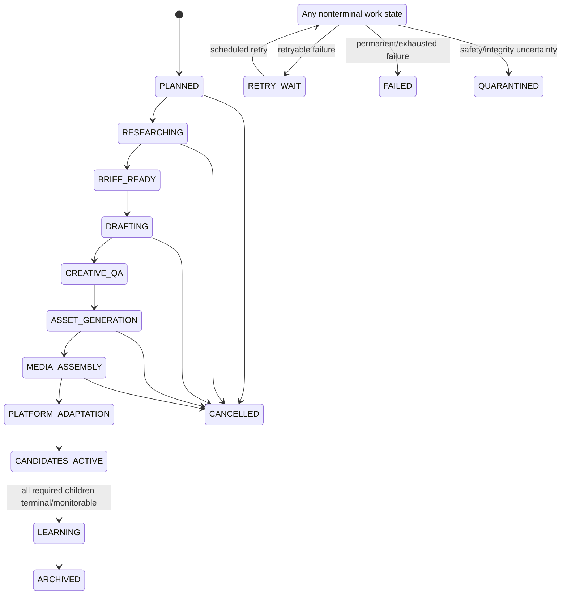
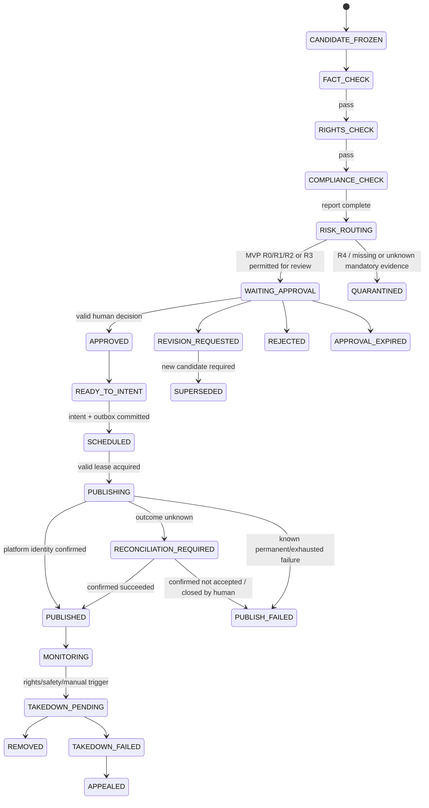

# Content and platform-candidate lifecycle

- Status: M1-02 workflow, M1-03 invalidation, and M1-06 human approval surface implemented
- Version: 0.3
- Normative for: M1 workflow, approval, outbox, reconciliation, stop, and later publishing tasks
- Derived from: [technical baseline](../baseline/AI超级IP全Agent公司技术方案_v1.md)

## 1. Separation of lifecycles

`ContentUnit` expresses progress of one source content idea. Each `PlatformCandidate` has its own immutable payload, checks, approval, schedule, publish, monitoring, and takedown lifecycle. A parent must never claim “published” when one child succeeded, another failed, and a third awaits approval.

## 2. Parent ContentUnit states



The diagram's `ACTIVE` is explanatory, not a persisted state. Persist the concrete state plus failure category, attempt, next retry time, input/output version, and trace.

### Parent completion rule

The parent enters `CANDIDATES_ACTIVE` after all requested platform candidates exist or the missing platforms have explicit failure/cancellation records. It enters `LEARNING` only when required children are in a policy-defined observable terminal state (for example `PUBLISHED/MONITORING`, package delivered with manual follow-up, rejected, quarantined, or failed with owner). Parent progress is derived from child facts; it cannot overwrite child states.

## 3. PlatformCandidate states



For a package-only branch, `SCHEDULED → PACKAGE_READY → PACKAGE_DELIVERED → MANUAL_RECONCILIATION → PUBLISHED|CLOSED_UNPUBLISHED`. Package delivery is not publication and must never fabricate a platform post ID.

## 4. Transition guards

| Transition | Mandatory guards / effects |
|---|---|
| Freeze candidate | Canonical payload contains platform, account, title, caption, normalized sorted tags, ordered asset hashes, disclosure, and policy version; object digests exist. A schedule is frozen separately and bound by the later request fingerprint. |
| Checks advance | Structured report valid and refers to the frozen candidate hash/final artifact closure; unknown/missing/expired evidence blocks. |
| Risk → approval | Required reports and hashes exist; R4 cannot request an override to publish; MVP R0/R1/R2 all require final approval. R3 follows explicit per-item human rules and never auto-publishes. |
| Approve | During early/MVP operation, one authenticated authorized human is sufficient; Agent/service identities cannot approve. Candidate/reports/policy/account must be unchanged and the approval records actor/time/expiry. Real T3 actions remain disabled; a later production policy may require two distinct MFA humans after D-008. |
| Approval → intent | Same transaction revalidates candidate hash, report hashes, approval validity/expiry, policy, account/Scope, global/account stop, budget, and repost semantics; creates intent and outbox atomically. |
| Scheduled → publishing | Worker obtains short lease and repeats candidate/approval/stop/account/budget checks immediately before request. |
| Publishing → retry | Only classified transient failures with a known-not-accepted result may retry the same intent within bounds. Unknown outcome enters reconciliation, not retry. |
| Confirm published | Official response/query or permitted human evidence maps the exact intent/candidate to a stable platform post ID. |
| Revocation/takedown | Cancel unopened work; invalidate relevant approvals; block new intent/lease; propagate dependency closure; create one takedown/review job per confirmed post. |

## 5. Canonical identity and invalidation

Conceptual candidate identity:

```text
candidate_hash = sha256(canonical_json({
  title,
  caption,
  sorted_tags,
  ordered_asset_hashes,
  ai_disclosure,
  platform,
  account_id,
  policy_version
}))

request_fingerprint = sha256(
  candidate_hash + platform + account_id + normalized_schedule_slot
)
```

M1-03 implements the byte-level rules in [canonical JSON and approval binding v1](canonical-json-v1.md): UTF-8 without BOM/newline, Unicode NFC, UTF-8 byte key ordering, safe integers, exact booleans/null, UTC millisecond timestamps, and distinct absence versus null. The approval snapshot binds the candidate, fact-report, rights-manifest, risk-report, policy, account, action, distinct human approver(s), decision time, and expiry. Its own hash is recomputed before use.

M1-02 implements the durable path in [Temporal workflow v1](temporal-workflow-v1.md).
Temporal owns replayable timers/signals/retries and PostgreSQL Activities own authoritative
compare-and-swap state plus the atomic intent/outbox transaction.

Any bound value change invalidates the approval and requires a new immutable candidate/report/approval chain. A legitimate repost creates a new `publish_intent_id`, explicit reason, and separately approved schedule; it does not mutate uniqueness data.

## 6. Failure taxonomy

| Class | Examples | Default action |
|---|---|---|
| Retryable | Timeout before accepted request, 429, temporary network/service unavailable | Exponential backoff + jitter within attempts/cost/deadline; same business intent |
| Permanent | Invalid schema/parameter, permission absent, rights missing, policy block | Stop and expose actionable failure; no automatic retry |
| Unknown side-effect outcome | Upload/create may have succeeded but response was lost | `RECONCILIATION_REQUIRED`; query official capability or request human evidence; no re-send |
| Safety/integrity uncertainty | Untrusted file, policy conflict, unverifiable claim, audit mismatch | Quarantine and notify responsible human |
| Cancellation | Human stop, rights revocation, upstream rejection, budget hard stop | Cancel not-yet-submitted tasks and downstream expensive work; audit result |

After three retryable failures (or a lower task-specific bound), the item becomes failed/quarantined/dead-lettered with an owner; it never disappears or returns to an unspecified state.

## 7. Concurrency invariants

1. State transitions use expected version/compare-and-swap semantics; stale workers cannot advance a newer version.
2. Exactly one active publish lease exists per intent; lease expiry alone does not prove the previous external call failed.
3. Outbox dispatch is at-least-once internally, while adapter invocation is protected by stable intent/fingerprint and reconciliation.
4. Stop and revocation are authoritative transactional facts, not cache-only flags.
5. No transition deletes prior candidates, reports, approvals, attempts, or audit evidence.

## 8. Required M1 acceptance scenarios

- Restart API/worker/Temporal during approval wait and resume the same state.
- Change one caption character and prove old approval cannot create an intent.
- Submit the same approved request concurrently 100 times and observe one intent/external logical action.
- Raise global and account stop while a worker waits; worker fails lease recheck before external submission and P95 is measured.
- Simulate a lost response after Mock acceptance; observe reconciliation and no duplicate.
- Feed missing rights, expired consent, R4 risk, invalid webhook signature, and Agent tool escalation; each fails closed and is audited.
- Revoke a source right; observe unpublished descendants cancel and existing platform posts receive individual takedown jobs.
